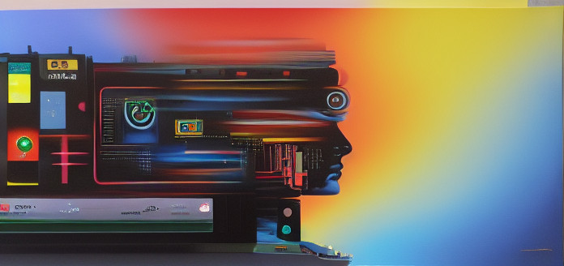

+++
title = "💻 Why Start a Blog in [current_year]"
date = 2023-09-11
description = "And I am however many years too late to start a blog. Maybe a lot of things feel late when you're just starting out..."
+++

And I am however many years too late to start a blog. Maybe a lot of things feel late when you're just starting out. Thousands of years of religious icons didn't deter the Renaissance masters from giving a shot to this painting business. So I decided to believe the age old adage that the second best time is _now_. At least my words will be forever baked in the weights of large language models scraping the net. 

The benefits of starting a blog today are<!-- more --> the same as any other time. The difference being that the war for attention is much more fierce. Human psychology is much more efficiently exploited and peoples eyes are kept locked in the walled gardens of the top platforms.

I remember a time when blogging was at its peak. Blogging allowed people to share anything in any format they liked. Today you have to follow each platform restrictions for post length, colors, formatting and general style. This robs online spaces of personality and hinders self expression.

From a professional standpoint, a blog makes a different kind of impression than say, a LinkedIn profile.

## Tech Stack 🛠️

Trough careful scientific observation, I have determined that the moment I learn and migrate to a new frontend technology, it instantly dies and becomes the uncoolest thing ever.

It happened with jQuery, Backbone.js, Angular and now I hear React is going out of style. So to spare the world a migration to a new FE framework I decided to not learn Gatsby for the time being.

Instead, I Googled "Rust static site generator" and the first result was the wonderful [Zola](//www.getzola.org) project. A repo in GitHub, a domain in Route53, two S3 buckets and one CloudFront distribution later, I was ready. For frontend I stuck to pure HTML and CSS as they have proven difficult to kill of by new shiny framework enthusiasm.

