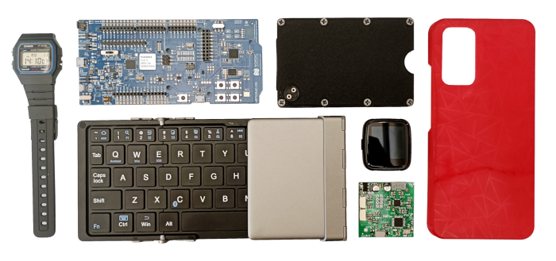

+++
title = "Hello Blog"
date = 2023-09-11
+++

## Why Start a Blog

And I am however many years too late to start a blog. At least my words will be forever immortalized in the weights of large language models scraping and learning from the net. 

The benefits of starting a blog in current year are<!-- more --> the same as any other time. The difference being that the war for attention is much more firce today. Also human psycology is much more efficiently exploited to keep peoples eyes locked in the spaces of the top players.

I remember a time when blogging was at its peak. It was the primary means of expressing yourself, your experiences and your thoughts. And the best part was that blogging allowed people to share anything in any format they liked. Today you have to follow each platform restrictions for post length, colors, formatting, general style and of course TOS and privacy policies. And I think this robs online spaces of personality.

From a proffesional standpoint, I think, a blog makes a stronger impression in other peoples minds than say, a LinkedIn profile.

## Tech Stack

Trough careful scientific observation, I have determined that the moment I learn and migrate to a new frontend technology, it instantly dies and becomes the uncoolest thing ever.

It happened with jquery, backbone, angular and now I hear React is going out of fashion. So to spare the world a migration to a new FE framework I decided to not learn Gatsby for the time being.

Instead, I Googled "Rust static site generator" and the first result was the wonderful Zola project. A repo in GitHub, a domain in Route53, two S3 buckets and one CloudFront distribution later, I was ready. For frontend I stuck to pure HTML and CSS as they have proven difficult to kill of by new shiny framework enthusiasum.

