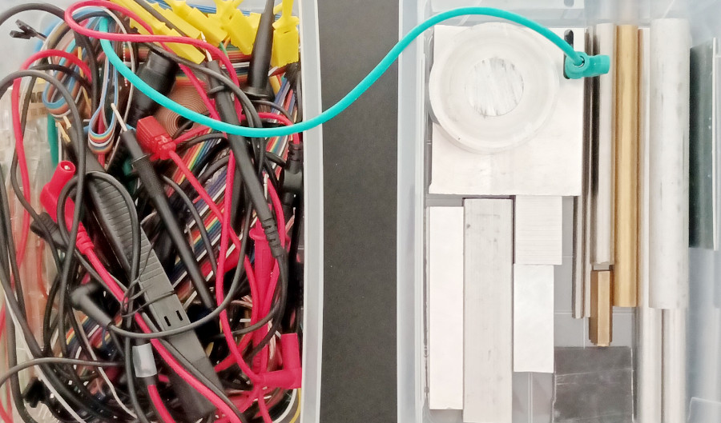
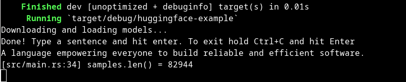
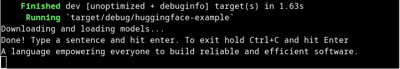

+++
title = "🤗 Calling Hugging Face models from Rust"
date = 2023-09-13
description = "This post describes a simple approach on calling Hugging Face ML models from a Rust codebase via Python interop"
+++



Recently I wanted to include 🤗 **Transformers** in a Rust voice assistant I was working on. It's muscle memory for me now to search for a pure Rust implementation of whatever I'm trying to do. Unfortunately, even though the machine learning landscape in Rust is gaining momentum, I couldn't find a crate that can load and run the specific set of models I needed on the **GPU**.<!-- more --> Specially the architectures currently popular on [Hugging Face](https://huggingface.co/).

If you're reading this in a couple of years, first check the state of the art on [Are we learning yet?](https://www.arewelearningyet.com/) The two most capable projects currently are [burn](https://github.com/burn-rs/burn) and [transformer-deploy](https://github.com/ELS-RD/transformer-deploy) Check them out first! Both require some conversion steps to be applied to each model, and not all models are supported. But if they support your workload, a pure Rust implementation should always be preferred.

As much as I grumbled, I realized I needed to call Python code from Rust. To my pleasant surprise, doing so is simple with the awesome [PyO3](https://pyo3.rs) crate. This guide isn't anything complicated, it's aim is to save you (and even myself in a month or two) a few minutes of stumbling on how to fit these pieces together.

The approach outlined here involves linking Python with your Rust binary. For the models to respond as quickly as possible they are loaded at startup in video memory (if present). Subsequently, the Rust code invokes a Python function responsible for inference.

### Setting Up the Environment

We're gonna need a Rust app and a Python virtual environment in it.

```bash
cargo new huggingface-example
```
Then **cd** into the directory
```bash
cd huggingface-example/
```
Add the necessary dependencies
```bash
cargo add cpal anyhow pyo3 -F pyo3/auto-initialize
```
Init the Python environment and add it to .gitignore. This will make sure that anything you do and install will be self contained to the current folder.
```bash
python -m venv .venv && echo ".venv" >> .gitignore
```
Activate the newly created virtual environment:
```bash
source .venv/bin/activate
```
Create a `requirements.txt` file in the root of your app with the following content:
```
transformers
torch
torchvision
torchaudio
datasets
sentencepiece
```
You can, of course, only include the dependencies you need. Install them via pip:
```bash
pip install -r requirements.txt
```

### Python Land

Create a `huggingface.py` file in the root of your app

```python
from transformers import SpeechT5Processor, SpeechT5ForTextToSpeech, SpeechT5HifiGan
from datasets import load_dataset
import torch

device = "cuda" if torch.cuda.is_available() else "cpu"

MODEL = "microsoft/speecht5_tts"
processor = SpeechT5Processor.from_pretrained(MODEL)
model = SpeechT5ForTextToSpeech.from_pretrained(MODEL).to(device)
vocoder = SpeechT5HifiGan.from_pretrained("microsoft/speecht5_hifigan").to(device)

embeddings_dataset = load_dataset("Matthijs/cmu-arctic-xvectors", split="validation")
speaker_embeddings = torch.tensor(embeddings_dataset[7306]["xvector"]).unsqueeze(0).to(device)

def text_to_speech(text):
    inputs = processor(text=text, return_tensors="pt").to(device)
    speech = model.generate_speech(inputs["input_ids"], speaker_embeddings, vocoder=vocoder)

    return speech.cpu().numpy()
```

The important thing to note here is that this is very little code. It's almost identical to the [example](https://huggingface.co/microsoft/speecht5_tts#how-to-get-started-with-the-model) given in the official model card. This way, you can easily pick and use almost any [model](https://huggingface.co/models) from Hugging Face.

The main difference from the official example is that we're moving the model inference step inside a function. We will now call that from Rust.

### Rust Land

We're going to create a simple app that reads user input from stdin, sends it to the `text_to_speech` function in Python and then plays the resulting audio back via the [cpal](https://crates.io/crates/cpal) crate.

Lets start with the basics, open the `main.rs` file and include anyhow and PyO3's prelude. Then initialize the [Python Global Interpreter Lock (GIL)](https://docs.rs/pyo3/latest/pyo3/marker/struct.Python.html#method.with_gil).
```rust
use anyhow::{anyhow, Result};
use pyo3::prelude::*;

fn main() -> Result<()> {
    Python::with_gil(|py| {
        Ok(())
    })
}
```

We then load the Python file we created in the last step

```rust
use anyhow::{anyhow, Result};
use pyo3::prelude::*;

fn main() -> Result<()> {
    Python::with_gil(|py| {
        println!("Downloading and loading models...");

        let module = PyModule::from_code(
            py,
            include_str!("../huggingface.py"),
            "huggingface.py",
            "huggingface.py",
        )?;

        Ok(())
    })
}
```

Running this, you should see "Downloading and loading models..." followed by the output of the actual download progress. They should be cached for subsequent runs.

Finally, get the `text_to_speech` function pointer and call it each time a new line comes from stdin.

```rust
// include this
use std::io::{self, BufRead};

use anyhow::{anyhow, Result};
use pyo3::prelude::*;

fn main() -> Result<()> {
    Python::with_gil(|py| {
        println!("Downloading and loading models...");

        let module = PyModule::from_code(
            py,
            include_str!("../huggingface.py"),
            "huggingface.py",
            "huggingface.py",
        )?;

        let text_to_speech: Py<PyAny> = module.getattr("text_to_speech")?.into();

        println!("Done! Type a sentence and hit enter. To exit hold Ctrl+C and hit Enter");

        let stdin = io::stdin();

        for line in stdin.lock().lines() {
            let Ok(text) = line else {
                break;
            };

            let samples: Vec<f32> = text_to_speech.call1(py, (text,))?.extract(py)?;
            dbg!(samples.len());
        }

        Ok(())
    })
}
```

Here we iterate trough each line and call the `text_to_speech` method with it. We then [extract](https://pyo3.rs/v0.19.2/conversions/traits.html?highlight=extract#extract-and-the-frompyobject-trait) the result. Use `let samples: String = ...` if the model is doing text generation.

Running this we can see the number of sound samples generated by the model.



To play them we need to include the means to sleep a thread and `cpal`:
```rust
use std::thread::sleep;
use std::time::Duration;

use cpal::{
    traits::{DeviceTrait, HostTrait, StreamTrait},
    BufferSize, OutputCallbackInfo, Sample, SampleRate, StreamConfig,
};
```

Then replace
```rust
dbg!(samples.len());
```
with
```rust
play(samples)?;
```

Finally add the `play` function to the `main.rs` file.

```rust
fn play(mut smaples: Vec<f32>) -> Result<()> {
    let duration = smaples.len() as f32 / 16000.0;
    smaples.reverse();

    let host = cpal::default_host();
    let device = host
        .default_output_device()
        .ok_or(anyhow!("No playback device found"))?;

    let err_fn = |err| eprintln!("an error occurred on the output audio stream: {}", err);

    let config = StreamConfig {
        channels: 1,
        sample_rate: SampleRate(16_000),
        buffer_size: BufferSize::Default,
    };

    let stream = device.build_output_stream(
        &config,
        move |data: &mut [f32], _: &OutputCallbackInfo| {
            for sample in data.iter_mut() {
                *sample = smaples.pop().unwrap_or(Sample::EQUILIBRIUM);
            }
        },
        err_fn,
        None,
    )?;

    stream.play()?;

    sleep(Duration::from_secs_f32(duration));

    Ok(())
}
```

Running this you should hear back any line that you type:



<audio controls src="stt-example.mp3">
  Your browser does not support the audio tag.
</audio> 

### Saving to File

To save the resulting audio samples as a `.wav` file we need to add the `hound` crate
```bash
cargo add hound
```

Include it at the top of the `main.rs` file

```rust
use hound::{SampleFormat, WavSpec, WavWriter};
```

Add a call to `save` alongside the play method

```rust
save(&samples)?;
play(samples)?;
```

Then add the `save` method somewhere in `main.rs`

```rust
fn save(samples: &[f32]) -> Result<()> {
    let spec = WavSpec {
        channels: 1,
        sample_rate: 16000,
        bits_per_sample: 32,
        sample_format: SampleFormat::Float,
    };

    let mut writer = WavWriter::create("voice.wav", spec)?;

    for s in samples {
        writer.write_sample(*s)?;
    }

    Ok(())
}
```

### Going Further

**Offline Models**

I needed to train and ship my own models to a server. And I didn't want it to wait, download or touch the network every time the app is started. To achieve this two environment variables need to be set before initializing PyO3.

```rust
std::env::set_var("TRANSFORMERS_OFFLINE", "1");
std::env::set_var("HF_DATASETS_OFFLINE", "1");
```

The trained models can be placed in a `data` directory (don't forget to use git LFS) and referenced when initializing Python objects
```python
processor = SpeechT5Processor.from_pretrained("data/speecht5_tts_voxpopuli_bg")
```

This way models will be loaded locally, without reaching trough the network.

**Using Channels for Communication**

To isolate the Python communication layer from the rest of the application I used channels. At startup, two channels are created and the Python interpreter is launched on a separate thread. One is used to send messages to the "AI" thread and another to receive back data. This way the resulting communication layer can be made to work [with](https://docs.rs/tokio/latest/tokio/sync/mpsc/fn.channel.html) or [without](https://doc.rust-lang.org/stable/std/sync/mpsc/fn.channel.html) an async runtime.

Message passing avoids the need to resort to synchronization primitives like Mutex and RwLock. It also keeps the Python communication self-contained, making it easily swappable for a pure Rust alternative, without affecting other parts of your code.

### Cleanup

To deactivate the Python environment type `deactivate`` in the console
```bash
deactivate
```
Since we're linking Python in our Rust executable, `cargo run` no longer works after the environment is deactivated.

I also like to delete the .venv folder if I'm not going to fiddle with the project for some time. It's 4.7GB for the above dependencies:
```bash
rm -rf .venv
```

Remove the rust build artifacts, as they can grow to a considerable size too
```bash
cargo clean
```

### References

- [Hugging Face](https://huggingface.co/)
- [Are we learning yet?](https://www.arewelearningyet.com/)
- [PyO3](https://pyo3.rs)
- [speecht5_tts](https://huggingface.co/microsoft/speecht5_tts)
- [cpal](https://crates.io/crates/cpal)
- [burn](https://github.com/burn-rs/burn)
- [transformer-deploy](https://github.com/ELS-RD/transformer-deploy)